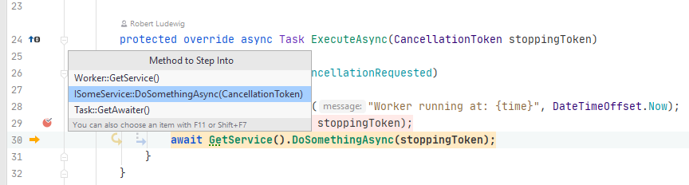

# Rider SmartStep Bug
A simple project to reproduce a "SmartStep Into" bug in Rider

When the debugger hits line 30 in `Worker.cs`, and you then do "Step into" (F11) and the select `DoSomethingAsync` in the popup from the screenshot below, nothing happens in Rider 2020.1. Eventually the the debugger will hit line 32.

